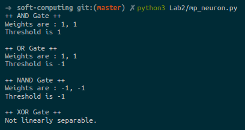

# Soft Computing
Implementation of algorithms for soft computing. It consists of 
1. Artificial Neural Networks
2. Fuzzy logic
3. Genetic algorithms

This repository contains all the labwork that I did during
my Bachelors course on Soft computing.

### Lab 2 : McCulloch-Pitts Neuron
Create a simulation of the MP neuron model for AND, NAND and OR gates. [link](Lab2/)

