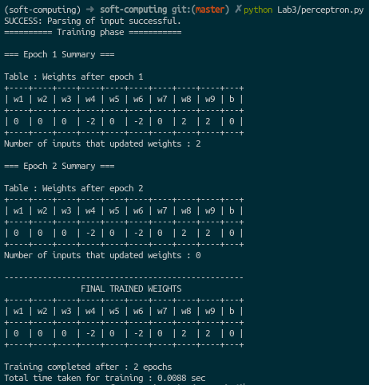

# Soft Computing
Implementation of algorithms for soft computing. It consists of 
1. Artificial Neural Networks
2. Fuzzy logic
3. Genetic algorithms

This repository contains all the labwork that I did during
my Bachelors course on Soft computing.

### Lab 2 : McCulloch-Pitts Neuron
Create a simulation of the MP neuron model for AND, NAND and OR gates. [link](Lab2/)


### Lab 3 : Perceptron Network
Implement a Perceptron Network to recognize patterns given from a input file.  [link](Lab3/)

Example Pattern
```
* * *
. * .
* * *
Output = 1

* * *
* * *
* . .
Output = -1
```

The perceptron should output '1' on seeing the first pattern, and output '-1' after seeing the second pattern. 
[Example pattern file](Lab3/pattern.txt) 




